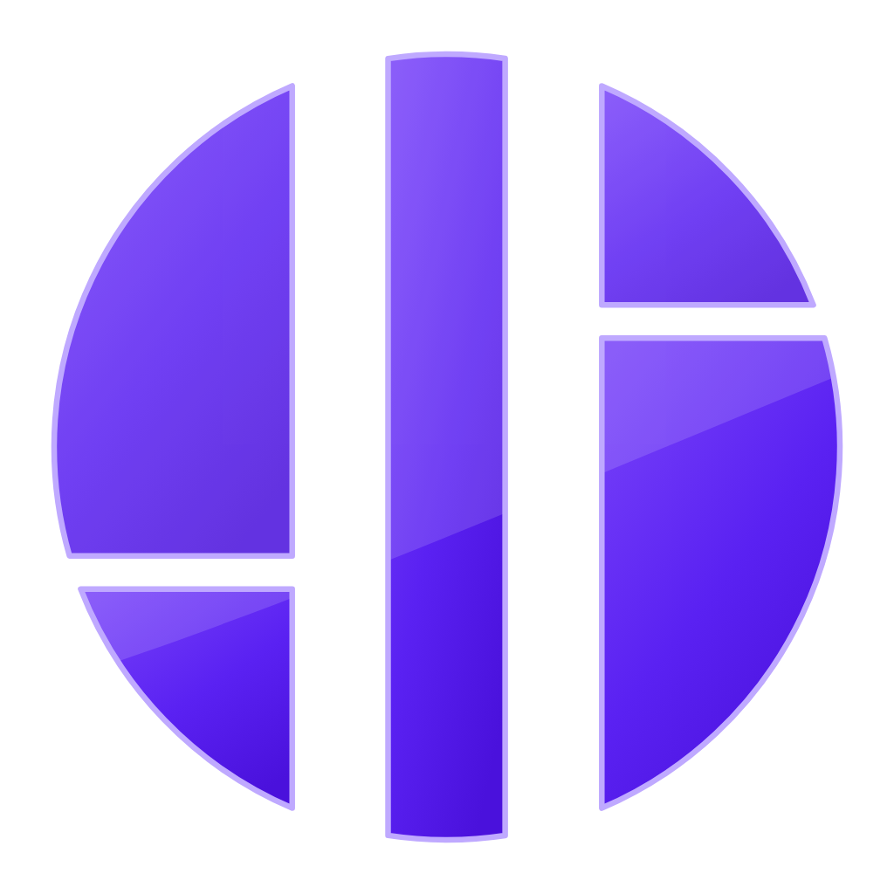
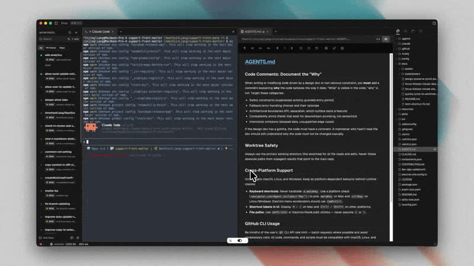
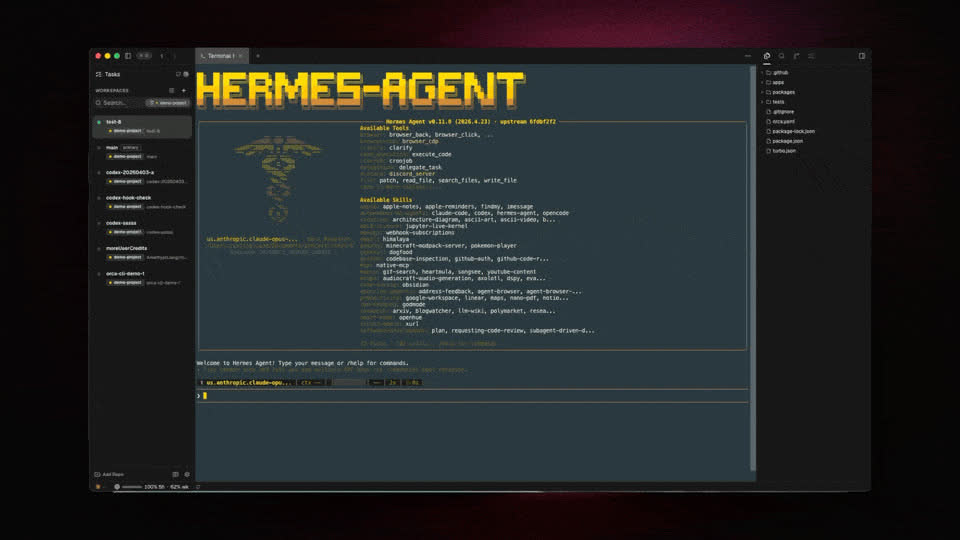
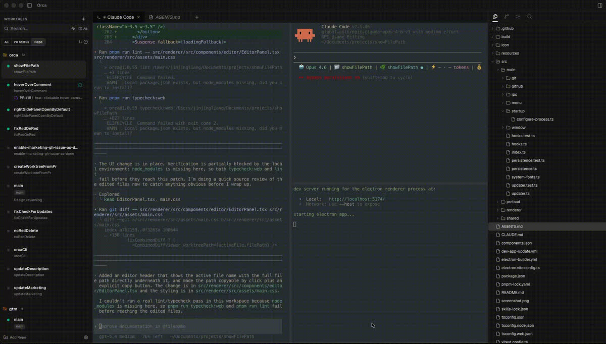
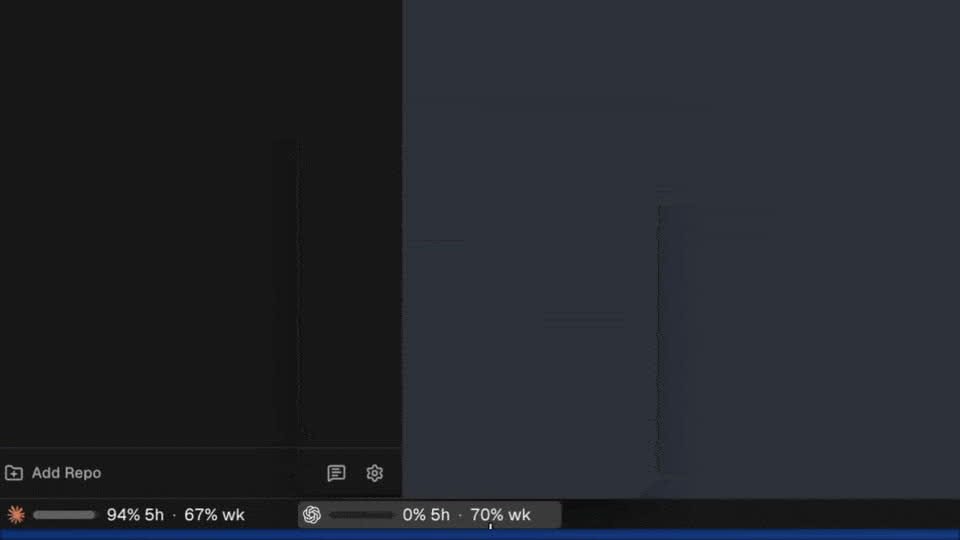

<p align="center">
  
</p>

<h1 align="center">OxeeUI</h1>

<p align="center">
  
  
  <a href="https://github.com/stablyai/orca"></a>
  
</p>

<p align="center">
  Oxeegen's agentic development environment — run any CLI coding agent in its own<br/>
  git worktree, with the terminal, editor and diff review in one window.
</p>

<h3 align="center"><a href="https://github.com/Oxeegen/OxeeUI/releases/latest"><ins>Download the latest release</ins></a></h3>

<p align="center">
  
</p>

<p align="center"><sub><em>Interface screenshots are taken from upstream Orca and still show upstream branding.</em></sub></p>

---

**OxeeUI** runs coding agents the way a team actually works: several at once, each isolated in its own git worktree, with the terminal, file tree, editor and diff review side by side. Claude Code, Codex, Grok, Cursor, Copilot, OpenCode, Qwen, Kimi — if it runs in a terminal, it runs here.

Agents run under **your own subscriptions**. There is no Oxeegen account, no per-seat service in the middle, and no telemetry: upstream's build identity and analytics keys are compile-time substitutions that only upstream's release CI fills in, so they resolve to null in this build and the transport short-circuits.

> OxeeUI is a rebranded, Oxeegen-configured fork of **[Orca](https://github.com/stablyai/orca)** (MIT) by Lovecast Inc. The fork keeps a deliberately small diff against upstream — everything Oxeegen-specific lives under [`brand/`](brand/README.md), and upstream files carry only thin hooks that read from it, so merges stay mechanical.

## Download

Builds live on the [**Releases**](https://github.com/Oxeegen/OxeeUI/releases) page.

| Version | Platform | File |
|---|---|---|
| **0.1.0** | Windows x64 | `oxeeui-windows-setup.exe` |
| **0.1.0** | Linux x86_64 | `oxeeui-linux-x86_64.AppImage` |

Builds are **unsigned**, so Windows SmartScreen warns on first run — choose **More info → Run anyway**.

**macOS is deliberately not built.** Without an Apple Developer certificate the DMG is refused by Gatekeeper until the user works around it, which is worse than shipping nothing. A mac target joins the build matrix once signing exists.

In-app updates work, and point at *this* repository's releases rather than upstream's.

## Features

<table>
<tr>
<td width="50%" valign="middle">

### Parallel Worktrees

Fan one prompt across several agents, each in its own isolated git worktree — compare the results and merge the winner.

</td>
<td width="50%">
  <picture><source srcset="brand/assets/readme/feature-wall/parallel-worktrees.gif" type="image/gif"></picture>
</td>
</tr>
<tr>
<td width="50%" valign="middle">

### Any CLI Agent

Claude Code, Codex, Grok, Cursor, Copilot, OpenCode, Qwen, Kimi, Goose, Cline and the rest — all driven from one window, on your own subscriptions.

</td>
<td width="50%">
  <picture><source srcset="brand/assets/readme/feature-wall/cli-agents.gif" type="image/gif"></picture>
</td>
</tr>
<tr>
<td width="50%" valign="middle">

### Terminal Splits

Ghostty-class terminals with WebGL rendering, infinite splits, and scrollback that survives restarts.

</td>
<td width="50%">
  <picture><source srcset="brand/assets/readme/feature-wall/terminal-splits.gif" type="image/gif"></picture>
</td>
</tr>
<tr>
<td width="50%" valign="middle">

### Annotate AI Diffs

Drop comments on any diff line and send them straight back to the agent — review, edit and commit without leaving the app.

</td>
<td width="50%">
  <picture><source srcset="brand/assets/readme/feature-wall/annotate-diff.gif" type="image/gif"></picture>
</td>
</tr>
<tr>
<td width="50%" valign="middle">

### Drag Files to Agents

A VS Code-class editor with autosave everywhere — drag files or images straight into an agent's prompt.

</td>
<td width="50%">
  <picture><source srcset="brand/assets/readme/feature-wall/file-drag.gif" type="image/gif"></picture>
</td>
</tr>
<tr>
<td width="50%" valign="middle">

### Accounts and Usage

See usage and rate-limit resets per provider, and hot-swap accounts without logging in again.

</td>
<td width="50%">
  <picture><source srcset="brand/assets/readme/feature-wall/codex-accounts.gif" type="image/gif"></picture>
</td>
</tr>
</table>

**Also in the box:** quick open across worktrees, files, agents and commands · Markdown, image and PDF previews in the workspace · notifications and unread state when an agent finishes or needs attention · scriptable automation from the CLI.

## What Oxeegen changes

| Area | Change |
|---|---|
| Identity | OxeeUI name, `com.oxeegen.oxeeui` app id, `OxeeUI` / `oxeeui` executables |
| Mark | Custom icon drawn from the Oxeegen circle geometry — app icon, dock, installer and titlebar |
| Theme | Oxeegen token overrides layered on upstream's stylesheet |
| Product name | Swapped at render time, leaving all five locale catalogs byte-identical so upstream merges stay clean |
| Settings | 13 of 33 sections hidden — upstream's first-party services, dev scaffolding, and capabilities outside this product |
| Updates | Update feed points at this fork's releases rather than upstream's |
| CI | All 57 upstream workflow jobs guarded, so a fork push doesn't run upstream's build matrices on our quota |
| Releases | Own pipeline — push an `oxeeui-v*` tag and Windows and Linux builds publish here |
| Platforms | Windows and Linux (AppImage); macOS deliberately absent |
| Telemetry | Inert — upstream's build identity and analytics keys resolve to null in a fork build |

**Technical identifiers keep upstream's names on purpose.** The CLI binary is still `orca`, alongside `orca.yaml`, `~/.orca` and the `ORCA_*` environment variables. They are load-bearing, and the rebrand matches only the capitalised standalone product name — so scripts and config written against upstream keep working.

**Hiding a Settings section removes an entry point, not a capability.** A hidden feature is still compiled in and may remain reachable from its own UI. Anything that must be genuinely unavailable needs a real gate.

## Built on Orca

OxeeUI is a fork of **[stablyai/orca](https://github.com/stablyai/orca)** — the open-source agentic development environment by Lovecast Inc., MIT licensed. Upstream documentation applies to every core feature:

- [Orca docs](https://www.onorca.dev/docs) — worktrees, terminal, editing, review
- [Orca releases](https://github.com/stablyai/orca/releases) — upstream changelog

Oxeegen's changes are confined to branding, packaging, the update feed and Settings scope; the environment itself is upstream's work. Upstream is merged in periodically.

OxeeUI is not affiliated with, endorsed by, or supported by Lovecast Inc. **Report OxeeUI problems here, not upstream.**

## Developing

[`brand/README.md`](brand/README.md) is the reference for the fork: the layout of the brand layer, the fourteen hook lines in upstream files, the mark geometry, the release process and the upstream-merge runbook.

```bash
pnpm install
pnpm dev                      # dev run, drained-chroma icon
pnpm run brand:assets         # apply brand assets over the upstream paths
pnpm run build:win:brand      # or build:linux:brand
pnpm run brand:verify         # run after every upstream merge
```

`brand:verify` checks that the brand assets are still applied, that every hook still reaches into `brand/`, that no hidden Settings section was renamed out from under us, that every upstream workflow job is still guarded, and that the rebrand still leaves the technical identifiers alone.

Cutting a release is a tag:

```bash
git tag -a oxeeui-v0.1.1 -m "Release notes go here"
git push origin oxeeui-v0.1.1
```

The tag name sets the packaged version, and an annotated tag's message becomes the release notes. Versions are numbered independently of upstream.

## Known gaps

- **No code signing.** Windows shows a SmartScreen warning on install, and macOS is not built at all. Both need certificates — a purchasing decision, not a code one.
- **Forced and locked configuration is not wired.** Defaults and locked keys still need work in the persistence and settings-IPC layers.
- **Two alternate icons** in the Settings icon picker are still upstream artwork; only the default entry is branded.
- **Two macOS-only integrations** still carry upstream's bundle id — a permission-prompt watcher and the local-build compatibility stamp. Both are self-consistent, and moot while macOS is unbuilt.

The translated READMEs under `docs/readme/` are upstream's and still describe Orca.

## License

[MIT](LICENSE) — inherited from Orca, © Lovecast Inc. Oxeegen's additions are MIT on the same terms.
