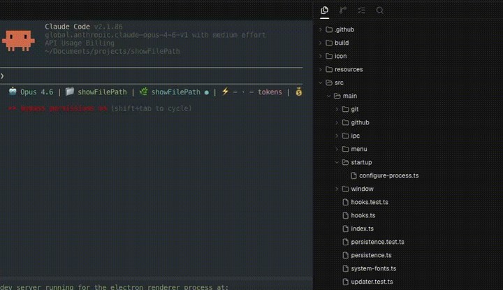

<p align="center">
  
</p>

<h1 align="center">OxeeUI</h1>

<p align="center">
  <sub><a href="../../README.md">English</a> · <strong>Français</strong></sub>
</p>

<p align="center"><b>L'environnement de développement agentique d'Oxeegen.</b><br/>
Lancez n'importe quel agent de code dans son propre worktree git — terminal, éditeur et revue de diff dans une seule fenêtre.</p>

<p align="center">
  <a href="../../LICENSE"></a>
  <a href="https://github.com/Oxeegen/OxeeUI/releases/latest"></a>
  <a href="https://github.com/Oxeegen/OxeeUI/releases"></a>
  
</p>

<p align="center">
  <a href="#téléchargement"><b>Téléchargement</b></a> ·
  <a href="#fonctionnalités"><b>Fonctionnalités</b></a> ·
  <a href="#agents-compatibles"><b>Agents</b></a> ·
  <a href="#la-pile-oxeegen"><b>Pile Oxeegen</b></a> ·
  <a href="#faq"><b>FAQ</b></a>
</p>

<p align="center">
  
</p>

**OxeeUI** fait travailler les agents de code comme une équipe travaille vraiment :
plusieurs en même temps, chacun isolé dans son propre worktree git, avec le terminal,
l'arborescence des fichiers, l'éditeur et la revue de diff côte à côte. Confiez une
tâche à un agent, continuez votre travail, et revenez à une branche prête à être relue.

- **Plusieurs agents, une seule fenêtre.** Claude Code, Codex, Grok, Cursor, GitHub
  Copilot, OpenCode, Qwen Code, Kimi et une vingtaine d'autres tournent côte à côte.
  S'il tourne dans un terminal, il tourne ici.
- **Un travail isolé.** Chaque tâche a son propre worktree git : les agents ne se
  marchent jamais dessus — ni sur vos modifications.
- **Relire avant de fusionner.** Lisez le diff, annotez n'importe quelle ligne, renvoyez
  vos remarques à l'agent, puis committez, sans quitter l'application.
- **En local ou à distance.** Travaillez sur cette machine, ou sur un hôte SSH avec
  édition de fichiers, git et terminaux.
- **Sans compte, sans mesure d'audience.** Vos dépôts restent où ils sont, et les builds
  d'OxeeUI ne contiennent aucune clé d'analytics : aucune donnée d'utilisation n'est
  envoyée.
- **Au cœur de la pile Oxeegen.** Le poste du développeur dans une pile d'IA souveraine,
  bâtie sur les modèles et les serveurs d'Oxeegen — voir [La pile Oxeegen](#la-pile-oxeegen).

**L'obtenir :** [Windows](https://github.com/Oxeegen/OxeeUI/releases/latest/download/oxeeui-windows-setup.exe) (x64) ·
[Linux](https://github.com/Oxeegen/OxeeUI/releases/latest/download/oxeeui-linux-x86_64.AppImage) (AppImage) —
configuration requise dans [Téléchargement](#téléchargement).

## Fonctionnalités

<table>
<tr>
<td width="50%" valign="middle">

### Worktrees en parallèle

Envoyez un même prompt à plusieurs agents, chacun dans son propre worktree git isolé —
comparez les résultats et fusionnez le meilleur.

</td>
<td width="50%">
  <picture><source srcset="../../brand/assets/readme/feature-wall/parallel-worktrees.gif" type="image/gif"></picture>
</td>
</tr>
<tr>
<td width="50%" valign="middle">

### Tous les agents CLI

Claude Code, Codex, Grok, Cursor, OpenCode, Qwen Code, Kimi, Goose, Cline et les autres —
tous pilotés depuis une seule fenêtre, avec vos propres abonnements.

</td>
<td width="50%">
  <picture><source srcset="../../brand/assets/readme/feature-wall/cli-agents.gif" type="image/gif"></picture>
</td>
</tr>
<tr>
<td width="50%" valign="middle">

### Terminaux divisés

Des terminaux rapides au rendu GPU, divisibles à volonté, dont l'historique survit aux
redémarrages.

</td>
<td width="50%">
  <picture><source srcset="../../brand/assets/readme/feature-wall/terminal-splits.gif" type="image/gif"></picture>
</td>
</tr>
<tr>
<td width="50%" valign="middle">

### Annoter les diffs de l'IA

Commentez n'importe quelle ligne d'un diff et renvoyez vos remarques directement à
l'agent — relisez, modifiez et committez sans quitter l'application.

</td>
<td width="50%">
  <picture><source srcset="../../brand/assets/readme/feature-wall/annotate-diff.gif" type="image/gif"></picture>
</td>
</tr>
<tr>
<td width="50%" valign="middle">

### Glisser des fichiers vers les agents

Un éditeur complet avec sauvegarde automatique partout — glissez un fichier ou une
image depuis l'arborescence directement dans le prompt d'un agent.

</td>
<td width="50%">
  <picture><source srcset="../../brand/assets/readme/feature-wall/drag-files.gif" type="image/gif"></picture>
</td>
</tr>
</table>

**Également inclus :**

- **Worktrees SSH** — faites tourner des agents sur une machine distante avec édition de
  fichiers, git et terminaux, avec reconnexion automatique en cas de coupure.
- **GitHub dans l'application** — parcourez les pull requests et les issues, et ouvrez un
  worktree directement depuis une tâche.
- **Ouverture rapide** — passez d'un worktree, d'un fichier, d'un agent ou d'une commande
  à l'autre sans lâcher le clavier.
- **Comptes et consommation** — utilisation et réinitialisation des quotas par
  fournisseur, avec changement de compte sans nouvelle connexion.
- **Markdown et aperçus** — éditez le Markdown dans un éditeur riche, et prévisualisez
  images et PDF dans l'espace de travail.
- **Notifications et état « non lu »** — sachez quand un agent a terminé ou attend une
  action, et marquez les fils comme non lus pour y revenir plus tard.
- **Des icônes familières** — Material Icon Theme, le même jeu que VS Code, dans
  l'explorateur, les onglets, la recherche, le contrôle de source et les diffs.
- **Prêt à l'emploi** — un nouveau profil s'ouvre avec l'apparence Oxeegen : thème
  sombre, Cascadia Code et Monokai.

## Agents compatibles

Compatible avec **tous les agents en ligne de commande**. Ceux-ci sont reconnus
d'emblée :

<table>
<tr>
<td><a href="https://ampcode.com/manual#install"> Amp</a></td>
<td><a href="https://antigravity.google/docs/cli-overview"> Antigravity</a></td>
<td><a href="https://docs.augmentcode.com/cli/overview"> Auggie</a></td>
<td><a href="https://github.com/autohandai/code-cli"> Autohand Code</a></td>
<td><a href="https://docs.anthropic.com/claude/docs/claude-code"> Claude Code</a></td>
</tr>
<tr>
<td><a href="https://docs.cline.bot/cline-cli/overview"> Cline</a></td>
<td><a href="https://www.codebuff.com/docs/help/quick-start"> Codebuff</a></td>
<td><a href="https://github.com/openai/codex"> Codex</a></td>
<td><a href="https://commandcode.ai/docs/quickstart"> Command Code</a></td>
<td><a href="https://docs.continue.dev/guides/cli"> Continue</a></td>
</tr>
<tr>
<td><a href="https://github.com/charmbracelet/crush"> Crush</a></td>
<td><a href="https://cursor.com/cli"> Cursor</a></td>
<td><a href="https://devin.ai/cli"> Devin</a></td>
<td><a href="https://docs.factory.ai/cli/getting-started/quickstart"> Droid</a></td>
<td><a href="https://docs.github.com/en/copilot/how-tos/set-up/install-copilot-cli"> GitHub Copilot</a></td>
</tr>
<tr>
<td><a href="https://block.github.io/goose/docs/quickstart/"> Goose</a></td>
<td><a href="https://x.ai/cli"> Grok</a></td>
<td><a href="https://hermes-agent.nousresearch.com/docs/"> Hermes Agent</a></td>
<td><a href="https://kilo.ai/docs/cli"> Kilo Code</a></td>
<td><a href="https://www.kimi.com/code/docs/en/kimi-code-cli/getting-started.html"> Kimi</a></td>
</tr>
<tr>
<td><a href="https://kiro.dev/docs/cli/"> Kiro</a></td>
<td><a href="https://mimo.xiaomi.com/coder"> MiMo Code</a></td>
<td><a href="https://github.com/mistralai/mistral-vibe"> Mistral Vibe</a></td>
<td><a href="https://omp.sh"> oh-my-pi</a></td>
<td><a href="https://openclaude.gitlawb.com/"> OpenClaude</a></td>
</tr>
<tr>
<td><a href="https://opencode.ai/docs/cli/"> OpenCode</a></td>
<td><a href="https://pi.dev"> Pi</a></td>
<td><a href="https://github.com/QwenLM/qwen-code"> Qwen Code</a></td>
<td><a href="https://support.atlassian.com/rovo/docs/install-and-run-rovo-dev-cli-on-your-device/"> Rovo Dev</a></td>
<td><b>+ tout agent CLI</b></td>
</tr>
</table>

## La pile Oxeegen

Oxeegen construit une **pile d'IA souveraine** : ses propres modèles, servis depuis ses
propres serveurs d'inférence, et les applications de bureau qui les mettent au travail.

| | |
|---|---|
| **Modèles Oxeegen** | Max, Pro, Flash et Instant, qui tournent sur les serveurs d'Oxeegen et sont servis par une API compatible OpenAI, avec des régions US et UE. |
| **[OxeeOffice](https://github.com/Oxeegen/OxeeOffice)** | La suite bureautique IA : fichiers Word, Excel, PowerPoint et PDF, édités avec une IA qui tourne sur les modèles d'Oxeegen. |
| **[VOxee](https://github.com/Oxeegen/VOxee)** | La voix en texte : dictée, transcription de réunions et notes, sur les modèles auto-hébergés d'Oxeegen. |
| **OxeeUI** | L'environnement de développement agentique — ce dépôt. |

OxeeUI est le poste du développeur dans cette pile. Il fait tourner les agents de code
que votre équipe utilise déjà, avec les abonnements que vous avez déjà. Les agents qui
acceptent un endpoint compatible OpenAI personnalisé — OpenCode, Qwen Code, Cline ou
Kilo Code, par exemple — peuvent être branchés sur les modèles d'Oxeegen : la partie
modèle de la boucle tourne alors elle aussi sur les serveurs d'Oxeegen.

## Téléchargement

| Plateforme | Configuration requise | Téléchargement |
|---|---|---|
| **Windows** (x64) | Windows 10 ou plus récent | [`oxeeui-windows-setup.exe`](https://github.com/Oxeegen/OxeeUI/releases/latest/download/oxeeui-windows-setup.exe) |
| **Linux** (x86_64) | Environnement FUSE 2 | [`oxeeui-linux-x86_64.AppImage`](https://github.com/Oxeegen/OxeeUI/releases/latest/download/oxeeui-linux-x86_64.AppImage) |

Toutes les versions et leurs notes sont sur la page [Releases](https://github.com/Oxeegen/OxeeUI/releases).
Les installateurs **ne sont pas signés** : au premier lancement, Windows SmartScreen
affiche un avertissement — choisissez **Informations complémentaires → Exécuter quand
même**. Il n'existe pas encore de build macOS : sans certificat Apple Developer,
Gatekeeper refuse l'application.

<details>
<summary><b>Lancer l'AppImage sous Linux</b></summary>

L'AppImage s'exécute sur place. Installez l'environnement FUSE 2 s'il manque
(`sudo apt install libfuse2` ; sous Ubuntu 24.04, le paquet s'appelle `libfuse2t64`),
rendez le fichier exécutable, puis lancez-le :

```bash
chmod +x oxeeui-linux-x86_64.AppImage
./oxeeui-linux-x86_64.AppImage
```

</details>

## FAQ

<details>
<summary><b>OxeeUI est-il gratuit ?</b></summary>

Oui. OxeeUI est un logiciel open source distribué sous licence MIT. Les agents que vous
lancez utilisent vos propres abonnements ou clés d'API.

</details>

<details>
<summary><b>Avec quels agents de code fonctionne-t-il ?</b></summary>

Avec tout agent qui tourne dans un terminal. Ceux de la liste
[Agents compatibles](#agents-compatibles) sont reconnus d'emblée ; tout autre agent en
ligne de commande tourne dans un onglet de terminal classique.

</details>

<details>
<summary><b>OxeeUI envoie-t-il mon code quelque part ?</b></summary>

Non. Les dépôts et les worktrees restent sur votre machine, ou sur les hôtes SSH que vous
connectez. Les builds d'OxeeUI ne contiennent aucune clé d'analytics : aucune donnée
d'utilisation n'est envoyée. Les agents que vous lancez échangent avec leurs propres
fournisseurs de modèles, exactement comme dans n'importe quel terminal.

</details>

<details>
<summary><b>Puis-je utiliser les modèles d'Oxeegen ?</b></summary>

Oui, avec tout agent qui accepte un endpoint compatible OpenAI personnalisé, comme
OpenCode, Qwen Code, Cline ou Kilo Code : saisissez l'endpoint de votre région Oxeegen
(US ou UE) et votre clé d'API Oxeegen dans les réglages de l'agent. Les clés sont
délivrées par région.

</details>

<details>
<summary><b>Les agents peuvent-ils tourner sur une machine distante ?</b></summary>

Oui. Les worktrees SSH donnent à un agent un hôte distant avec édition de fichiers, git
et terminaux, et se reconnectent automatiquement en cas de coupure.

</details>

<details>
<summary><b>Existe-t-il une version macOS ?</b></summary>

Pas encore. Un build macOS nécessite un certificat Apple Developer ; sans lui,
Gatekeeper refuse l'application.

</details>

<details>
<summary><b>Pourquoi Windows affiche-t-il un avertissement à l'installation ?</b></summary>

L'installateur n'est pas encore signé, donc SmartScreen ne le reconnaît pas. Choisissez
**Informations complémentaires → Exécuter quand même**.

</details>

## Développement

```bash
pnpm install
pnpm dev
```

Les vérifications, la création des installateurs et les releases sont décrites dans
[CONTRIBUTING.md](../../.github/CONTRIBUTING.md) (en anglais).

## Licence

OxeeUI est un logiciel open source distribué sous [licence MIT](../../LICENSE).

Maintenu par [Oxeegen](https://oxeegen.com).
